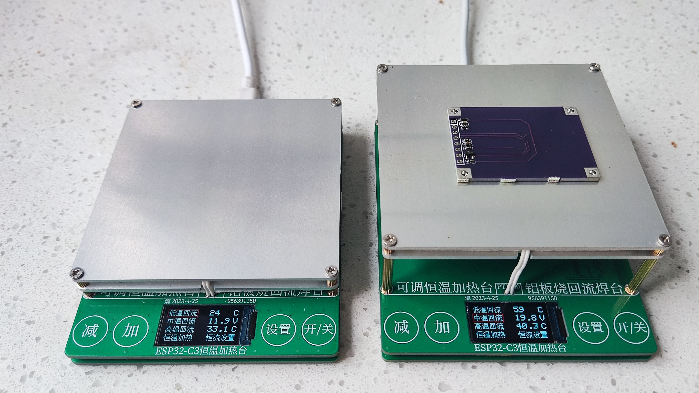
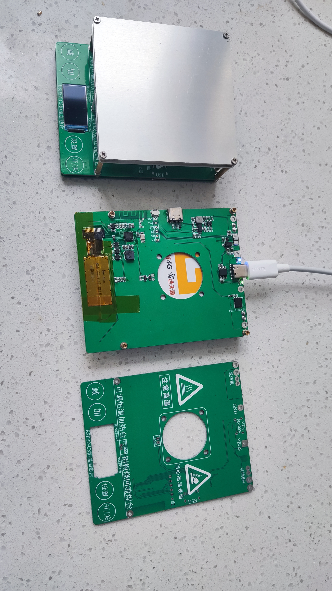

#  ESP32加热台

### ESP32加热台采用TYPE-C快充诱骗供电 ，通过减少发热板内阻和PWM控制MOS进行恒流驱动，解决了PCB发热板铜线电阻随温度增加而增加导致无法满功率运行的问题， 同时采用大功率测试针给发热板供电简化了装配流程

 
#### 功能简介
1.  主TYPE-C接口通过CH224K快充诱骗供电，最大支持PD100W（20V/5A）
2.  侧TYPE-C接口主要用于USB 下载程序
3   PT1000 铂热电阻测温  范围：-50℃~300℃
4.  0.96寸 ST7735  160*80显示屏 显示各种参数
5.  4个触摸按键进行功能切换 参数设置   一个EN复位按键
6.  供电电压电流测量  ESP32 C3 芯片内部温度测量   蜂鸣器等
7.  支持不同诱骗供电电压的恒流阈值设置
8.  加热板尺寸：8cm*8cm  铝基板
9.  拥有恒温加热模式和回流焊模式

##### 功能模式
1.  上电进入初始页面  设置键选择对应的工作模式  开关键选择进入或退出
2.  低温回流焊模式：低温锡膏回流焊模式  开关键进入后设置键控制开启或关闭
3.  中温回流焊模式：中温锡膏回流焊模式  开关键进入后设置键控制开启或关闭
4.  高温回流焊模式：高温锡膏回流焊模式  开关键进入后设置键控制开启或关闭
5.  恒温加热模式：开关键进入后 设置键控制开启或关闭 加减键调节需要恒定的温度
6.  恒流设置模式：开关键进入后 设置键选择对应的电压范围 加减键调节最大恒定电流

##### 程序下载
1.  此程序基于Arduino IDE开发  源程序和依赖库在附件内  内有编译导出的烧录文件 
2. 编译环境： arduino1.8.19  /  esp32_package_2.0.5
3. 编译前需要安装相关库 和选择对应的开发板芯片设置
4.  芯片初次下载程序时 USB不会识别 需要拉低P9引脚（按下加按键） 然后按下EN复位按键强制进入下载模式

 
##### 硬件装配
1.  主控板是普通RF-4材质 2层板  板厚1.6mm   发热板和隔热板都是铝基板  单层板厚1.6mm  
2.  ESP32加热台主要由主控PCBA + 发热板+ 隔热板 + 底板（空主控板）+ 测试针 + PT1000 + M2铜柱螺丝 + 隔热棉组成
3.  测试针有两种型号：(P113-H3.0-M2)*2 用于大加热台方案    (CSPA-6G/2S )*4 用于小加热台方案   选一种使用就行
4.  小加热台装配方案隔热性不太好 使用更多隔热棉  连接件参数：单通铜柱(M2*4+3)X8 + 双通铜柱(M2*3)X4 + 平头螺丝(M2*3)X8
5.  大加热台装配方案高度比较高所以体积较大   连接件参数：单通铜柱(M2*3+3)X8 + 双通铜柱(M2*20)X4 + 平头螺丝(M2*3)X8 + (M2螺母)X2
6.   隔热棉使用的是硅酸铝陶瓷纤维防火棉  需要自己用剪刀裁剪合适尺寸
7.  预留有风扇驱动引脚+FAN-   仅限大加热台装配方案使用   如果使用风扇可以不使用隔热棉  风扇型号:3007 5V直流散热风扇 

 
##### 注意事项
1.  电源供电默认使用PD100W的快充供电  PD65W供电无法满足200度以上的使用场景（烤肉）  12V*1.5A/18W供电只能热杯水
2.  软件最大设置温度范围：0℃~300℃  因为发热板是铝基板 不建议长时间在200℃以上使用   还有最好不要开到300℃ 
3.  回流焊模式由于没有强制散热装置  回流焊加热结束后进入冷却模式时仅靠空气对流散热速度较慢 无法跟上温度曲线  需要等一会蜂鸣器才会提示结束
4.  该项目软件还不是太完善 等以后学会LVGL 再来完善  
5.  元件参数以原理图为准 嘉立创没有的元件上淘宝   相关软硬件资料都在附件内
6.  此项目为 CC BY-SA 3.0 开源项目 如需大批量生产商用必需找原作者进行授权 自用和<100套商用售卖随意

##### 其他平台
1.  立创开源：https://oshwhub.com/fj956391150/esp32-jia-re-tai
2.  熵 2023-4-29

##### 实物展示

